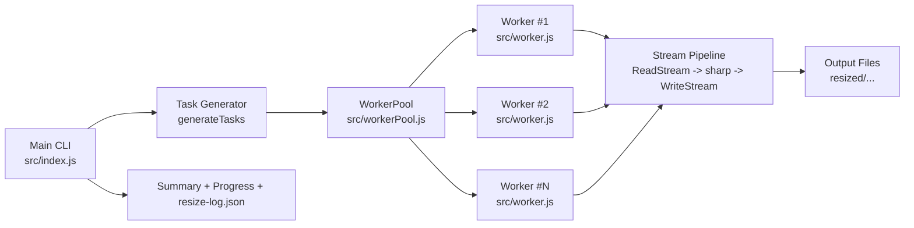

# Kiến trúc hệ thống - Node.js Core Image Resizer

## 1) Mục tiêu kiến trúc

Kiến trúc được thiết kế để:

- Tối ưu xử lý batch ảnh theo mô hình song song.
- Giữ mức sử dụng RAM ổn định bằng Streams & Buffers.
- Dễ mở rộng tính năng (multi-size, benchmark, logging).

## 2) Sơ đồ luồng tổng quát

## 3) Thành phần chính

### 3.1 Main CLI (`src/index.js`)

- Parse tham số CLI hoặc chạy interactive wizard.
- Quét danh sách ảnh từ thư mục input.
- Tạo danh sách task từ `--width` hoặc `--sizes`.
- Lọc task theo chính sách overwrite/skip.
- Điều phối xử lý song song qua `WorkerPool`.
- Thu thập thống kê và ghi `resize-log.json`.

### 3.2 WorkerPool (`src/workerPool.js`)

- Khởi tạo số worker dựa trên `--workers` (hoặc mặc định CPU - 1).
- Duy trì hàng đợi task và danh sách worker rảnh/bận.
- Tái sử dụng worker cho nhiều task.
- Đảm bảo đóng worker an toàn khi kết thúc hoặc có tín hiệu dừng.

### 3.3 Worker (`src/worker.js`)

- Nhận task qua `parentPort`.
- Tạo pipeline stream:
  - `fs.createReadStream(inputPath)`
  - `sharp().resize(...).jpeg/webp/avif(...)`
  - `fs.createWriteStream(outputPath)`
- Có retry tối đa khi gặp lỗi I/O tạm thời.
- Trả trạng thái `done` hoặc `error` về main thread.

### 3.4 Stream Pipeline

- Dữ liệu ảnh được truyền theo chunk qua buffer.
- Tránh nạp toàn bộ file vào RAM.
- Dễ quản lý lỗi và cleanup nhờ `pipeline(...)`.

## 4) Luồng xử lý chi tiết

1. Người dùng chạy CLI (command mode hoặc interactive mode).
2. Main quét toàn bộ ảnh trong input bằng `getAllImages(...)`.
3. Main sinh task resize theo từng file và từng kích thước.
4. Main tạo thư mục output tương ứng và đẩy task vào WorkerPool.
5. WorkerPool cấp task cho các worker rảnh.
6. Mỗi worker xử lý task bằng stream pipeline.
7. Worker trả kết quả về main.
8. Main cập nhật progress bar, summary bảng kết quả và benchmark thô (`--with-stats`).
9. Main ghi file `resize-log.json` trong thư mục output.

## 5) Vì sao kiến trúc này phù hợp yêu cầu môn học

- Đáp ứng đầy đủ Node.js Core API: `worker_threads`, `stream`, `fs`, `path`, `os`.
- Minh họa rõ cách kết hợp I/O stream với CPU-bound processing qua worker.
- Có thể trình bày trực quan hiệu năng bằng benchmark workers và memory usage.

## 6) Điểm mở rộng kiến trúc

- Thêm module `reporter` để export CSV/JSON cho benchmark.
- Thêm `task scheduler` thông minh (ưu tiên file lớn trước).
- Thêm chế độ watch folder để tự động resize khi có ảnh mới.
